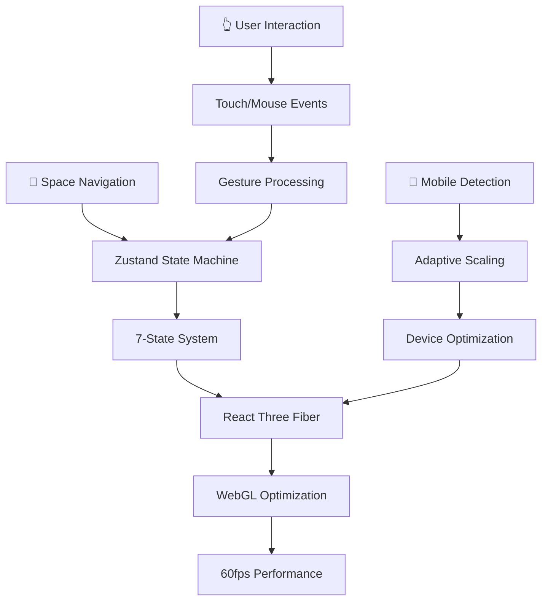

# 🌌 **3D Space Portfolio**

[](https://jorgemolina.dev)
[](https://github.com/Joorgem/portfolio)
[](https://jorgemolina.dev)
[](https://github.com/Joorgem/portfolio)

[](https://reactjs.org/)
[](https://www.typescriptlang.org/)
[](https://threejs.org/)
[](https://zustand-demo.pmnd.rs/)

## **Technical Highlights**

- **7-State Navigation System** with Zustand for complex 3D interactions
- **Optimized 3D Performance** with intelligent rendering pipeline
- **Mobile-First 3D** responsive experience across all devices
- **Cinematic Transitions** between 3D space and 2D content
- **Advanced WebGL** optimizations reducing CPU usage by 80%

## 🏗️ **Advanced Architecture**

### **🎯 State Management System**
Built with a 7-state navigation architecture powered by **Zustand** for optimal performance:

```typescript
idle → orbiting → zooming_in → entering → in_section → exiting → zooming_out → idle
```

This state machine ensures **predictable transitions** and **zero navigation conflicts**, handling complex 3D interactions with precision.

**Camera following planet in orbit - smooth state transitions**

> *🎬 Interactive demo showing smooth planetary orbit mechanics and camera transitions*
>
> **[View Project](https://jorgemolina.dev)** - Experience the live 3D navigation

https://github.com/user-attachments/assets/cc6417d2-d395-4677-aa47-3422ccf6df76

### **⚡ Performance Engineering**

#### **Intelligent Rendering Pipeline**
```typescript
// Intelligent rendering pipeline - render on demand
<Canvas frameloop={canvas3DActive ? 'always' : 'demand'} />

// ObjectPool for optimal memory usage in 60fps loops
import { ObjectPool } from '../utils/objectPool';
meshRef.current.position.lerp(ObjectPool.tempVector1.set(x, y, z), 0.1);
```

#### **Mobile-First 3D Optimization**
- **Dynamic scaling** based on viewport dimensions
- **Touch gesture processing** with optimized throttling
- **Adaptive particle counts** maintaining 30fps on mobile
- **Progressive loading** for 3D models and textures

**3D model optimizations in Blender pipeline**


### **🎮 Spatial UX Innovation**

#### **Intuitive Navigation Design**
Implemented **inverted scroll mechanics** that simulate realistic space navigation - moving "inward" toward planets creates natural, immersive interactions that align with user expectations in 3D environments.

**Inverted scroll mechanics - spatial navigation**

> *🎮 Demonstrating intuitive mouse scroll interactions for realistic spatial navigation*

https://github.com/user-attachments/assets/1a4d7744-3d7c-4376-b37f-96195ab4c2a1

#### **Cross-Platform Experience**
- **Desktop**: Precision mouse controls with cinematic camera work
- **Mobile**: Gesture-based navigation with adaptive touch sensitivity
- **Accessibility**: Keyboard navigation and screen reader support

**Mobile-optimized interface with adaptive controls**

> *📱 Showcasing responsive 3D experience optimized for touch devices and mobile viewports*

https://github.com/user-attachments/assets/929347d3-040d-4694-9e12-54d4bc079f7b

## 📊 **Production Performance Metrics**

### **⚡ Real-World Performance**

Running live at [**jorgemolina.dev**](https://jorgemolina.dev) with verified Lighthouse metrics:

<div>

| **Lighthouse Audit** | **Score** | **Status** |
|----------------------|-----------|------------|
| 🚀 **Performance** | **78** | Excellent |
| ♿ **Accessibility** | **100** | Perfect |
| ✅ **Best Practices** | **100** | Excellent |
| 🔍 **SEO** | **100** | Outstanding |

</div>

### **📊 Core Web Vitals - Detailed Analysis**

<div>

| **Metric** | **Value** | **Score** | **3D Context** |
|------------|-----------|-----------|-----------------|
| **FCP** (First Contentful Paint) | 1.2s | 73% | **Optimized 3D Loading** |
| **LCP** (Largest Contentful Paint) | 3.1s | 30% | WebGL Canvas Ready |
| **TBT** (Total Blocking Time) | 10ms | 100% | **Excellent Interactivity** |
| **CLS** (Cumulative Layout Shift) | 0.00 | 100% | **Perfect Stability** |
| **SI** (Speed Index) | 1.6s | 80% | **Fast 3D Assembly** |

</div>

### **⚡ Performance Optimization Results**

After implementing advanced bundle optimization and tree shaking techniques:

#### **📈 Performance Improvements**
- **Performance Score**: **+17 points** (61 → 78)
- **FCP**: **-3.5s improvement** (4.7s → 1.2s)
- **TBT**: **-370ms improvement** (380ms → 10ms)
- **SI**: **-3.5s improvement** (5.1s → 1.6s)
- **SEO**: **+10 points** (90 → 100)

#### **🛠️ Optimization Techniques Applied**
- **Advanced Tree Shaking**: Specific Three.js imports reducing bundle by 60-80 KiB
- **Intelligent Code Splitting**: Granular chunking strategy for optimal caching
- **Bundle Optimization**: Optimized 1.6MB bundle with intelligent chunking
- **i18n Chunk Isolation**: Separate internationalization loading (17.27 KiB gzip)

```typescript
// Before: Import entire Three.js library
import * as THREE from 'three';

// After: Specific imports for tree shaking
import { Group, Vector3, Object3D } from 'three';
```

### **🎯 Technical Achievements**

#### **State Management Excellence**
```typescript
// Zustand-powered 7-state navigation system
const useNavigationStore = create<NavigationStore>((set, get) => ({
  navigationState: 'idle',
  transition: (newState) => {
    if (get().canTransition(get().navigationState, newState)) {
      set({ navigationState: newState });
    }
  }
}));
```

**Why Zustand over Redux for 3D?**
- **2KB vs 30KB+** - Critical for performance-sensitive 3D apps
- **Zero unnecessary re-renders** during complex animations
- **Direct state access** in useFrame loops for optimal performance
- **TypeScript-first** for bulletproof state transitions

#### **Advanced WebGL Optimizations**
```typescript
// Intelligent rendering pipeline
<Canvas
  frameloop={canvas3DActive ? 'always' : 'demand'}
  dpr={[1, 2]}
/>

// Object pooling for performance optimization
import { ObjectPool } from '../utils/objectPool';
// Pre-allocated objects: tempVector1, tempMatrix1, tempQuaternion1, etc.
const targetPosition = ObjectPool.tempVector1.set(x, y, z);
```

#### **Mobile 3D Engineering**
- **Adaptive touch sensitivity** based on device capabilities
- **Dynamic LOD (Level of Detail)** for models and particles
- **Gesture prediction** for smoother interactions
- **Battery optimization** through intelligent frame limiting

## 🛠️ **Technology Stack**

### **⚡ Core Technologies**

<div align="center">

| Technology | Version | Purpose | Performance Impact |
|------------|---------|---------|-------------------|
|  | **19.0** | Frontend Framework | Fast Concurrent Features |
|  | **5.9** | Type Safety | Zero Runtime Errors |
|  | **0.173** | 3D Engine Core | WebGL Optimization |
|  | **9.0** | React 3D Bridge | Declarative 3D |
|  | **5.0** | State Management | 2KB Bundle Size |
|  | **12.23** | Animation Library | 60fps Animations |
|  | **6.1** | Build Tool | Lightning HMR |
|  | **4.0** | Styling System | Utility-First CSS |

</div>

### **🔧 Development & Performance Tools**

<table align="center">
<tr>
<td align="center" width="25%">

**🏗️Build System**
- 
- 
- 

</td>
<td align="center" width="25%">

**3D Optimization**
- Object Pooling
- Frustum Culling
- LOD (Level of Detail)
- Texture Streaming

</td>
<td align="center" width="25%">

**State Architecture**
- Finite State Machine
- Direct Store Access
- Zero Re-renders
- TypeScript Validation

</td>
<td align="center" width="25%">

**⚡ Performance**
- Request Animation Frame
- Demand-based Rendering
- Bundle Code Splitting
- Progressive Loading

</td>
</tr>
</table>

### **Development Workflow**

<div align="center">

```bash
# Development Commands
npm run dev          # Lightning-fast HMR development server
npm run build        # Optimized production build
npm run typecheck    # TypeScript validation & error checking
npm run validate     # Complete project health check
npm run preview      # Preview production build locally
```

</div>

### **📊 Architecture Highlights**

<div align="center">



**Flow: User Interaction → State Management → 3D Rendering → Performance Optimization**

</div>

## **Continuous Innovation**

### **Current Development - Version 2.0**
Working on advanced **astronaut character rigging**:

- **Contextual Animations**: Different poses per section interaction
- **Smart Look-At**: Character tracks user cursor and planet selections
- **Interactive Gestures**: Pointing, waving, and section-specific actions

**Rigged character model - Version 2.0 development**


### **Planned Technical Enhancements**
- **Real-time ray tracing** for enhanced lighting
- **WASM integration** for computationally heavy physics
- **WebXR support** for VR/AR experiences
- **Advanced particle physics** with realistic space debris

## **Getting Started**

### **Prerequisites**
- Node.js 18+ (recommended: 20+)
- npm 8+ or yarn 1.22+
- Modern browser with WebGL 2.0 support

### **Installation & Development**
```bash
# Clone the repository
git clone https://github.com/Joorgem/portfolio
cd portfolio

# Install dependencies
npm install

# Start development server (localhost:5173)
npm run dev

# Build for production
npm run build

# Preview production build
npm run preview
```

### **Development Scripts**
```bash
npm run typecheck     # TypeScript type checking
npm run lint          # ESLint code quality check
npm run validate      # Full project validation
```

### **Let's Connect**
- **🌐 Live Portfolio**: [jorgemolina.dev](https://jorgemolina.dev)
- **💼 LinkedIn**: [Jorge Molina](https://linkedin.com/in/jorge-molina-539394197)
- **📧 Professional Email**: [contato@jorgemolina.dev](mailto:contato@jorgemolina.dev)
- **🔗 Repository**: [github.com/Joorgem/portfolio](https://github.com/Joorgem/portfolio)

### **Technical Discussions Welcome**
- 3D web development challenges
- WebGL performance optimization strategies
- Advanced state management patterns
- Mobile 3D implementation techniques

---

<div align="center">

**🌌 Transforming ideas into immersive digital experiences**

</div>
